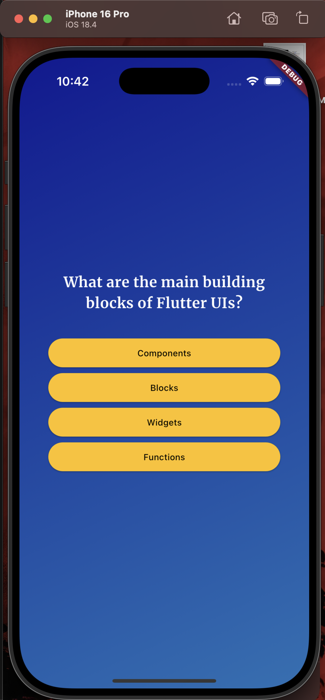
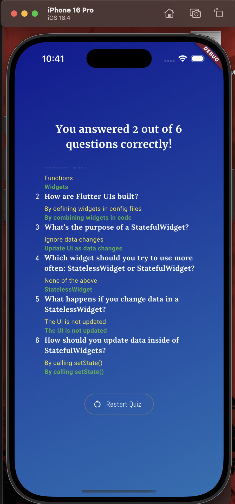

# Quizzler

A simple and fun quiz app built with Flutter!

## Features

- Multiple choice questions
- Progresses to the next question after each answer
- Shows results at the end of the quiz
- Option to restart the quiz
- Clean and modern UI with custom fonts

## Getting Started

1. **Clone the repository:**
   ```sh
   git clone <repo-url>
   cd quizzler
   ```

2. **Install dependencies:**
   ```sh
   flutter pub get
   ```

3. **Run the app:**
   ```sh
   flutter run
   ```

## Project Structure

- `lib/`
  - `main.dart` - Entry point
  - `quiz.dart` - Main quiz logic and screen switching
  - `question_screen.dart` - Displays questions and answers
  - `results_screen.dart` - Shows quiz results
  - `start_screen.dart` - Start screen UI
  - `Data/questions.dart` - List of quiz questions

## Screenshots
<p float="left">
  
  
  
</p>

## Credits

- Built with [Flutter](https://flutter.dev/)
- Fonts by [Google Fonts](https://fonts.google.com/)

---

Feel free to contribute or customize the questions!
